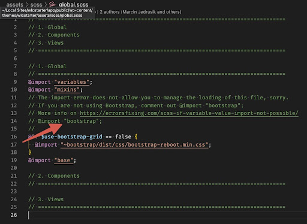

# Funkcjonalności

** Opis funkcjonalności na podstawie plików styli. **

Aby umieć efektywnie wykorzystać możliwości tego startera, należy się zapoznać z zawartością plików z możliwościami konfiguracji.
Pliki mają dodatkowe informacje w postaci komentarzy i czegoś na wzór spisu treści by ułatwić nawigację aczkolwiek,
by nie analizować ich wszystkich po kolei tutaj znajdziesz ich opis.

## /assets/scss/_variables.scss

** 1. Global **

** $use-bootstrap-grid: false; ** - tutaj możesz ustawić czy chcesz w swoim projekcie używać grid’a z Bootstrap 5. 
Jeżeli ustawisz tą zmienną na true większość rzeczy zrobi się automatycznie jak ładowanie pliku bootstrap-reboot.min.css w global.scss. 
Niestety istnieje pewien błąd importu w sass i jeżeli chcesz nadpisywać zmienne Bootstrap 5 musisz sam w pliku global.scss odkomentować 
linię z importem pliku ‘bootstrap’. To jedyna niedogodność, której na razie nie udało się rozwiązać i jest to problem globalny.



Jeżeli ta zmienna jest ustawiona jak domyślnie na ** false ** wtedy nie używamy importowanego grid’a z Bootstrap 5 i z dostępnych klas do 
budowania layoutu mamy tylko znajdujące się w pliku _base.scss klasy .row i .container. Nie musisz się bać eksperymentować z przełączeniem 
tej zmiennej. Wszystko jest tak przygotowane, że definiując sobie breakpointy oraz maksymalne szerokości dla kontenerów bez względu na to, 
czy używasz Bootstrap 5 czy nie, będą działać lub się integrować.

** $base-font-size: 16; ** - zmienna odpowiadająca za domyślny rozmiar czcionki. Proponuję nie modyfikować, dzięki czemu łatwiej się 
kontroluje rozmiar fontu jeżeli używasz skalowania w wykorzystaniem jednostek rem.

** $default-transition-duration: 0.15s;, $default-transition-timing: ease-in-out; ** - zmienne wykorzystywane w mixinie dla domyślnych tranzycji.

** $grid-gutter-width: 2rem; ** - ustawia domyślny padding dla kontenera (działa tylko z ustawieniami ** $use-bootstrap-grid: false; ** ).


** 2. Grid breakpoints **

Tutaj kontrolujesz ilość breakpointów. Możesz je usuwać, dodawać nowe. Integrują się z Bootstrap 5 jeżeli jest używany.


** 3. Container max-width sizes ** 

Tutaj kontrolujesz maksymalną szerokość kontenerów. Możesz je usuwać, dodawać nowe. Integrują się z Bootstrap 5 jeżeli jest używany.


** 4. Responsive Fonts **

Tutaj kontrolujesz pełne skalowanie wartości (jeżeli używasz jednostek rem lub funkcji pomocniczej rem() ).


** 5. Root variables **

Tutaj dodajesz swoje zmienne dla :root{}

## /assets/scss/_bootstrap.scss

** UWAGA: Ten plik jest używany tylko do importowania komponentów Bootstrap 5. **

## /assets/scss/_base.scss

Plik w którym dodajemy globalne style jak np. dla html, .row, .container. Klasy .row i .container są możliwe do użycia bez względu 
na to czy korzystasz z integracji z Bootstrap 5, czy też nie. Jeżeli korzystasz to nie zostaną załadowane. Jeżeli nie korzystasz 
z Bootstrap 5 zostaną ładowane. Wszystko jest tak przygotowane by nie miało to wpływu na wybór użycia Bootstrap 5, nie martw się :)


## /assets/scss/_mixins.scss

Plik zawiera zbiór mixin i funkcji scss, które mają na celu ułatwić tworzenie styli.

** 1. Disable user selection ** - umożliwia wyłączenie zaznaczania tekstu

```scss
.element {
    @include nonselect;
}
```


** 2. Color ** -


** 3. Truncate single line text ** - przycina text jednej linii jeżeli jest za długa dodając na końcu ‘...’

```scss
.element {
    @include truncateText;
}
```


** 4. Truncate multi line text ** - przycina tekst powyżej zdefiniowanej linii. W () należy podać po której linii tekst ma zostać przycięty.

```scss
.element {
    @include truncateLines(3);
}
```

  W tym przykładzie text zostanie przycięty na końcu trzeciej linii. Tekst z pozostałym linii nie będzie wyświetlany.


** 5. PX to REM ** - funkcja, która pomaga w przeliczaniu wartości px na wartości rem. Zalecana do powszechnego użycia

```scss
.element {
    font-size: rem(18);
}
```

  W tym przykładzie font-size zostanie przeliczony z wartości 18px na 1.125rem.


** 6. aspect-ratio ** - starsza metoda zachowania ratio dla elementów. Obecnie rzadko używana, ale może się komuś przydać. 
Wymaga podania wartości rozmiarów elementu a reszta zostanie wyliczona i będzie zachowywała ratio dla tego elementu.

```scss
.element {
    @include aspect-ratio(200, 300);
}
```


** 7. row ** - mixina wykorzystywana w klasie .row jeżeli nie korzystasz z Bootstrap 5.


** 8. Custom media queries up ** - mixina mediaquery dla rozdzielczości powyżej wybranego z predefiniowanych progów 
w _variables.scss integrująca się z Bootstrap 5 jeżeli jest wykorzystywany.

```scss
.element {
    @include media-breakpoint-up(lg) {
        …
    }
}
```


** 9. Custom media queries down ** - mixina mediaquery dla rozdzielczości poniżej wybranego z predefiniowanych 
progów w _variables.scss integrująca się z Bootstrap 5 jeżeli jest wykorzystywany.

```scss
.element {
    @include media-breakpoint-down(lg) {
        …
    }
}
```


** 10. Custom media queries between ** - mixina mediaquery dla rozdzielczości pomiędzy wybranymi z 
predefiniowanych progami w _variables.scss integrująca się z Bootstrap 5 jeżeli jest wykorzystywany.

```scss
.element {
    @include media-breakpoint-between(md,lg) {
        …
    }
}
```


** 11. Custom transition ** - mixina używana do transition gdzie ustawiane są domyślne wartości ze zmiennych 
$default-transition-duration oraz $default-transition-timing. Pomocna do utrzymania znormalizowanych transition dla elementów na stronie.

```scss
.element {
    @include transition();
}
```
```scss
.element {
    @include transition(opacity);
}
```
```scss
.element {
    @include transition(opacity, 0.3s);
}
```
```scss
.element {
    @include transition(opacity, 0.3s, ease-in);
}
```


** 12. Responsive ** - mixina Fluid Typography https://css-tricks.com/snippets/css/fluid-typography/ używana 
do “skalowania” nie tylko elementów tekstowych ale również wszelkich komponentów, właściwości, które używają wartości rem. 
Oparta o rozwiązanie korzystające z calc(). Używana na html, działa z media query. Domyślnie użyta w _base.scss na html. 
Działa ona tak, że w _variables.scss ustawiamy wartości dla skalowania pomiędzy ustawionymi wartościami i progami media query

** $min-font-size ** - min font size for responsive range

** $max-font-size ** - max font size for responsive range

** $min-vw ** - min width responsive range

** $max-vw ** - max width responsive range


Przykład zastosowania

```scss
html {
    @include fluid-type($min_width, $max_width, $min_font, $max_font);
}
```


