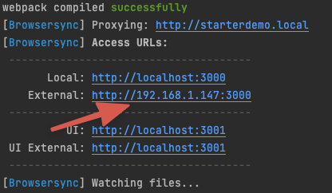

# Informacje ogólne

Dokumentacja ** WLC Starter **

## Cechy

- PHP OOP,
- przestrzeń nazw z automatycznym ładowaniem przy pomocy spl_autoload_register.
- kompatybilność z Bedrock (nie wymagane),
- zachowane standardy kodowania WordPress,
- metodologia View/class, block/class,
- obsługa zdefiniowanych pól ACF local JSON,
- kompilacja plików z wykorzystaniem Webpack (laravelmix),
- obsługa własnego grid’a (kompatybilna z Bootstrap 5),
- style reset z Bootstrap 5,
- pełna kompatybilność z Bootstrap 5 (nie wymagane),
- pomocny zbiór mixin,
- predefiniowane pola tekstowe ACF dla ```<head>```, ```<body>```, ```<footer>``` do obsługi własnego kodu,
- obsługa własnych styli dla edytora po stronie panelu admina z wykorzystaniem theme.json,
- obsługa inline SVG,

## Instalacja

1. W folderze themes pobierz [repozytorium](https://github.com/WhiteLabelCoders/wlc-starter) zamieniając nazwę “starter” na adekwatną do projektu.

  Z wykorzystaniem SSH
  ```bash
  git clone git@github.com:WhiteLabelCoders/wlc-starter.git starter
  ```

  lub przez HTTPS
  ```bash
  git clone https://github.com/WhiteLabelCoders/wlc-starter.git starter
  ```
<br/>
2. W oknie terminala wykonaj
  ```bash
  npm install
  ```
  lub
  ```bash
  yarn install
  ```
<br/>
3. Skopiuj plik ```.env.dist``` do ```.env``` i uzupełnij APP_URL np.
  ```bash
  APP_URL = starterdemo.local
  ```

  Nazwa ta powinna być taka jak ta pod którą masz dostęp do strony.
<br/>

## Standardy kodowania

Motyw wykorzystuje standardy kodowania [WordPress](https://developer.wordpress.org/coding-standards/wordpress-coding-standards/php/).
<br/>

## Development
1. W pliku ```wp-config.php``` ustaw

  ```bash
  define( 'WP_DEBUG', true );
  ```
<br/>

2. Przejdź do terminala i użyj
  ```bash
  npm run watch
  ```
  lub
  ```bash
  yarn watch
  ```

  Od tej pory pod adresem ```http://localhost:3000``` oraz tym zdefiniowanym w ```APP_URL``` z wywołaniem po porcie 3000 będzie dostępna strona gotowa do developmentu np. ```http://starterdemo.local:3000```
  z automatycznym przeładowaniem podczas wprowadzania zmian. W oknie terminala zobaczysz również adres pod którym będąc w obrębie swojej sieci wywołasz stronę np. na urządzeniu mobilnym.
  
  

  ** UWAGA: ** Pamiętaj aby przed wysłaniem zmian do repozytorium użyć
  ```bash
  npm run production
  ```
  lub
  ```bash
  yarn production
  ```
  aby pliki scss, js zostały zminifikowane.


<!-- # Tutorial Intro

Let's discover **Docusaurus in less than 5 minutes**.

## Getting Started

Get started by **creating a new site**.

Or **try Docusaurus immediately** with **[docusaurus.new](https://docusaurus.new)**.

### What you'll need

- [Node.js](https://nodejs.org/en/download/) version 16.14 or above:
  - When installing Node.js, you are recommended to check all checkboxes related to dependencies.

## Generate a new site

Generate a new Docusaurus site using the **classic template**.

The classic template will automatically be added to your project after you run the command:

```bash
npm init docusaurus@latest my-website classic
```

You can type this command into Command Prompt, Powershell, Terminal, or any other integrated terminal of your code editor.

The command also installs all necessary dependencies you need to run Docusaurus.

## Start your site

Run the development server:

```bash
cd my-website
npm run start
```

The `cd` command changes the directory you're working with. In order to work with your newly created Docusaurus site, you'll need to navigate the terminal there.

The `npm run start` command builds your website locally and serves it through a development server, ready for you to view at http://localhost:3000/.

Open `docs/intro.md` (this page) and edit some lines: the site **reloads automatically** and displays your changes. -->

